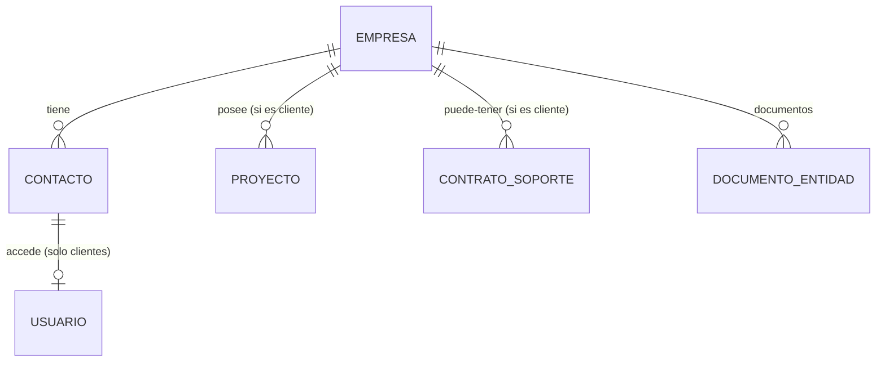

## MÓDULO 2: CRM (EMPRESAS, CONTACTOS Y PROVEEDORES)
### Especificación Detallada

---

## 1. PROPÓSITO DEL MÓDULO

Centralizar toda la información de los clientes y proveedores de Apex Connectivity, así como las personas que en ellos trabajan. Este módulo es la base sobre la que se construyen proyectos, tickets, compras y toda la relación comercial. Cada persona (contacto) tendrá su propia cuenta de acceso al sistema (si es cliente) o será un registro de contacto sin acceso (si es proveedor). Se incorporan clasificaciones, datos fiscales, documentos corporativos y un sistema de permisos basado en roles (definidos en Módulo 1) para que cada área (comercial, técnica, compras, facturación, marketing) acceda solo a la información que necesita.

---

## 2. ACTORES Y PERMISOS

### 2.1 Roles internos (personal de Apex)

| Rol | Permisos sobre CRM |
|-----|---------------------|
| **admin** | Acceso total a todas las empresas (clientes y proveedores) y contactos, incluyendo datos fiscales y documentos. Puede crear, editar y eliminar. |
| **comercial** | Puede ver, crear y editar empresas de tipo **cliente** (y sus contactos). No ve proveedores. Acceso a datos comerciales (nombre, industria, tamaño, origen, etc.) pero no a datos fiscales sensibles (RFC, dirección fiscal) a menos que sean necesarios para propuestas (se puede debatir). Por defecto, no ve datos fiscales. |
| **tecnico** | Solo ve las empresas **cliente** de los proyectos en los que está asignado. No ve proveedores. Acceso solo a datos básicos de la empresa y contactos técnicos. |
| **compras** | Puede ver, crear y editar empresas de tipo **proveedor** (y sus contactos). No ve clientes. Acceso a datos de contacto, fiscales y documentos de proveedores. |
| **facturacion** | Puede ver empresas de tipo **cliente** y **proveedor**, pero solo los datos necesarios para facturación (razón social, RFC, dirección fiscal, contactos de facturación, etc.). No puede editar. |
| **marketing** | Acceso de solo lectura a empresas de tipo **cliente** y **proveedor** (si se usan para campañas B2B), limitado a campos no sensibles: nombre, industria, tamaño, ciudad, país, sitio web, y datos de contacto (nombre, email, cargo). No ve datos fiscales ni notas internas. |

### 2.2 Roles externos (clientes)

| Rol | Permisos |
|-----|----------|
| **cliente** | Acceso al portal del cliente: solo ve su propia empresa, sus contactos, y documentos públicos de su empresa. No ve otras empresas ni proveedores. |

---

## 3. ESTRUCTURA DE DATOS

### 3.1 Entidad: EMPRESA

| Campo | Tipo | Descripción | Obligatorio |
|-------|------|-------------|-------------|
| id | UUID | Identificador único | Auto |
| **tipo_entidad** | enum | **cliente / proveedor / ambos** | Sí (default: cliente) |
| nombre | string | Razón social o nombre comercial | Sí |
| industria | enum | Tecnología / Salud / Educación / Finanzas / Comercio / Industria / Gobierno / Otro | No |
| tamaño | enum | Micro (1-10) / PYME (11-250) / Gran empresa (251+) | No |
| origen | enum | Web / Referencia / Llamada en frío / Evento / LinkedIn / Otro | No |
| tipo_relacion | enum | Cliente / Prospecto / Ex-cliente (solo si es cliente) | No (default: Cliente) |
| telefono_principal | string | | No |
| email_principal | string | | No |
| sitio_web | string | | No |
| direccion | text | Dirección física | No |
| ciudad | string | | No |
| pais | string | | No |
| notas_internas | text | Información relevante solo para el equipo | No |
| **--- Datos de facturación (aplica a clientes y proveedores) ---** | | | |
| razon_social | string | Razón social fiscal (si difiere del nombre comercial) | No |
| rfc | string | Registro Federal de Contribuyentes (o equivalente) | No |
| direccion_fiscal | text | Dirección para facturación | No |
| regimen_fiscal | string | Régimen fiscal | No |
| email_facturacion | string | Correo para envío de facturas | No |
| metodo_pago | enum | Transferencia / Tarjeta / Efectivo / Cheque / Otro | No |
| plazo_pago | integer | Días de crédito (ej: 30, 60) | No |
| moneda_preferida | enum | USD / MXN / EUR | No |
| **---** | | | |
| creado_en | timestamp | | Auto |
| creado_por | UUID | Usuario que creó el registro | Auto |
| ultima_actividad | timestamp | Fecha de última interacción (proyecto, ticket, compra) | Auto |

### 3.2 Entidad: CONTACTO

| Campo | Tipo | Descripción | Obligatorio |
|-------|------|-------------|-------------|
| id | UUID | | Auto |
| empresa_id | UUID | Empresa a la que pertenece | Sí |
| nombre | string | | Sí |
| cargo | string | | No |
| **tipo_contacto** | enum | **Técnico / Administrativo / Financiero / Compras / Comercial / Soporte / Otro** | **Sí** |
| email | string | **Debe ser único en todo el sistema** (para clientes, será su cuenta de acceso; para proveedores, es solo informativo) | Sí |
| telefono | string | | No |
| **es_principal** | boolean | Contacto principal para comunicaciones (aplica a clientes y proveedores) | Sí (default: false) |
| **recibe_facturas** | boolean | Si este contacto debe recibir facturas (solo para clientes) | No (default: false) |
| notas | text | | No |
| activo | boolean | Si sigue trabajando en la empresa | Sí (default: true) |
| usuario_id | UUID | Referencia al usuario en el sistema de autenticación (solo para clientes). Null para proveedores. | No |
| creado_en | timestamp | | Auto |

### 3.3 Entidad: DOCUMENTO_ENTIDAD (antes DOCUMENTO_EMPRESA)

| Campo | Tipo | Descripción |
|-------|------|-------------|
| id | UUID | |
| empresa_id | UUID | Empresa asociada (puede ser cliente o proveedor) |
| archivo_id | UUID | Referencia al archivo en Drive (FK a `archivos.id`) |
| visibilidad | enum | Interno (solo equipo) / Público (visible para el cliente en su portal) |
| descripcion | string | Breve descripción del documento |
| subido_por | UUID | |
| fecha_subida | timestamp | |

**Nota:** Los archivos se almacenan en Google Drive siguiendo la estructura:
```
/Clientes Activos/[Empresa]/Corporativo/
   ├── [visibilidad_interna]/
   └── [visibilidad_publica]/
/Proveedores/[Empresa]/Corporativo/   (similar, pero sin distinción público/interno? Por ahora solo interno)
```

### 3.4 Relaciones



---

## 4. PANTALLAS (Wireframes Descriptivos)

### 4.1 Listado de Empresas (con filtros por tipo)

```
+----------------------------------------------------------+
|  EMPRESAS                                   [+ NUEVA]    |
|                                                           |
|  [Buscar por nombre, email...                🔍]         |
|                                                           |
|  Tipo: [Todos ▼]  Industria: [Todas ▼]  Tamaño: [Todos ▼]
+----------------------------------------------------------+
|  +------------------------------------------------------+ |
|  | [CLIENTE] Soluciones Tecnológicas SA  | 3 contactos | |
|  | contacto@soluciones.com · Tecnología  | [Ver]       | |
|  +------------------------------------------------------+ |
|  | [PROVEEDOR] Dist. Mayorista SA        | 2 contactos | |
|  | ventas@distribuidor.com · Equipos     | [Ver]       | |
|  +------------------------------------------------------+ |
|  | [CLIENTE] Hospital Regional Norte     | 5 contactos | |
|  | compras@hospitalnorte.com · Salud     | [Ver]       | |
|  +------------------------------------------------------+ |
|                                                           |
|  [<< 1 2 3 ... 10 >>]                                     |
+----------------------------------------------------------+
```

### 4.2 Ficha de Empresa (Cliente) - similar a la versión anterior

(Se muestra el tipo "CLIENTE" y los datos de facturación, más los proyectos asociados)

### 4.3 Ficha de Empresa (Proveedor)

```
+----------------------------------------------------------+
|  PROVEEDOR: Distribuidor Mayorista SA          [Editar]  |
|                                                     [Eliminar]
+----------------------------------------------------------+

+------------------------+----------------------------------+
| DATOS PRINCIPALES       |  CONTACTOS (2)                   |
| Industria: Equipos      |  +----------------------------+  |
| Tel: +54 11 4321-5678   |  | ⭐ Juan Pérez (principal)  |  |
| Email: ventas@distri    |  | Comercial · juan@distri   |  |
| Web: www.distri.com     |  | [Editar] [Eliminar]       |  |
| Dirección: Av. Siempre  |  +----------------------------+  |
| Viva 456, CABA          |  | María Gómez                |  |
| Creado: 15/01/2026      |  | Soporte · maria@distri     |  |
+------------------------+  | [Editar] [Eliminar]       |  |
                           | [+ AGREGAR CONTACTO]       |  |
+------------------------+  +----------------------------+  |
| DATOS DE FACTURACIÓN    |                                   |
| Razón social: misma     |                                   |
| RFC: PROV123456XYZ      |                                   |
| Dirección fiscal: misma |                                   |
| Régimen: Persona Moral  |                                   |
| Email fact: cobros@distri|                                 |
| Método pago: Transf.    |                                   |
| Plazo: 30 días          |                                   |
| Moneda: USD             |                                   |
| [Editar datos fiscal]   |                                   |
+------------------------+----------------------------------+

+----------------------------------------------------------+
|  DOCUMENTOS                                            [+ SUBIR]
|  • Contrato_proveedor.pdf (interno)                     |
|  • Catálogo_equipos.pdf (interno)                       |
+----------------------------------------------------------+

+----------------------------------------------------------+
| NOTAS INTERNAS                                            |
| [Proveedor confiable. Envíos a 48hs. Contactar a Juan.]  |
| [Agregar nota...]                                         |
+----------------------------------------------------------+
```

### 4.4 Formulario de Empresa (Nueva/Editar) - con selector de tipo

```
+----------------------------------------------------------+
|  NUEVA EMPRESA                                 [Guardar] |
|                                            [Cancelar]     |
+----------------------------------------------------------+

+----------------------------------------------------------+
|  Tipo de entidad*: (●) Cliente  ( ) Proveedor  ( ) Ambos |
|                                                           |
|  Nombre*: [_____________________________________________] |
|  Industria: [Tecnología ▼]                               |
|  Tamaño: [PYME ▼]                                        |
|  Origen: [Web ▼] (solo para clientes)                    |
|  ... (resto de campos)                                   |
+----------------------------------------------------------+
```

### 4.5 Formulario de Contacto (adaptado a proveedores)

```
+----------------------------------------------------------+
|  NUEVO CONTACTO - Distribuidor Mayorista SA    [Guardar] |
+----------------------------------------------------------+

+----------------------------------------------------------+
|  Nombre*: [Juan Pérez_______________________________]    |
|  Cargo: [Gerente Comercial_________________________]    |
|  Tipo de contacto*: (●) Comercial  ( ) Soporte  ( ) Otro |
|  Email*: [juan@distri.com__________________________]    |
|  Teléfono: [+54 9 11 5678-1234_____________________]    |
|  [✔] Es contacto principal                               |
|  [ ] Recibe facturas (solo para clientes) - deshabilitado|
|  Estado: (●) Activo                                       |
+----------------------------------------------------------+
```

---

## 5. FLUJOS PRINCIPALES

### 5.1 Crear un nuevo cliente (desde comercial)
(Similar al original, pero ahora con campo tipo_entidad = 'cliente' o 'ambos')

### 5.2 Crear un nuevo proveedor (desde compras)
1. Usuario con rol compras va a "Empresas", selecciona filtro "Proveedores" o directamente "+ NUEVA"
2. En el formulario, elige tipo "Proveedor" (o "Ambos" si aplica)
3. Completa datos (nombre, industria, contacto, etc.)
4. Al guardar, se crea la empresa como proveedor.
5. Luego puede agregar contactos (sin crear usuarios, ya que no acceden al portal).

### 5.3 Agregar contacto a proveedor
- Similar a cliente, pero sin opción de "Enviar invitación al portal" (ya que los proveedores no acceden).

### 5.4 Marketing: consulta de datos para campañas
- El usuario de marketing accede a una vista especial (o al listado general con filtros) donde solo ve los campos permitidos.
- Puede exportar listados (nombre, email, industria, etc.) para campañas.

### 5.5 Alertas automáticas (n8n)
- **Empresa sin contacto principal** (para clientes y proveedores): notifica al admin y al responsable del área correspondiente (comercial para clientes, compras para proveedores).
- **Prospecto inactivo >60 días** (solo clientes): notifica a comercial.
- **Proveedor sin contacto principal**: notifica a compras.

---

## 6. REGLAS DE NEGOCIO ESPECÍFICAS (RN-CRM-xx)

| ID | Regla |
|----|-------|
| RN-CRM-01 | Una empresa puede tener MÚLTIPLES contactos, pero SOLO UNO puede ser "principal". |
| RN-CRM-02 | El email de contacto debe ser **único en todo el sistema** (no puede haber dos contactos con el mismo email, aunque sean de distintas empresas). |
| RN-CRM-03 | Un contacto inactivo NO puede ser asignado como responsable de nuevas tareas (en el módulo de tareas). |
| RN-CRM-04 | Al eliminar una empresa (solo admin): 
  - Si tiene proyectos activos (si es cliente) → BLOQUEAR eliminación.
  - Si tiene proyectos finalizados → Preguntar: "Esta empresa tiene proyectos finalizados. ¿Eliminar igual? Se perderá el histórico." |
| RN-CRM-05 | Los técnicos solo pueden ver empresas de proyectos en los que están asignados. |
| RN-CRM-06 | Un cliente (contacto) NO puede ver la lista de otras empresas, solo la suya propia. |
| RN-CRM-07 | Al crear una empresa, el tipo por defecto es "Cliente". |
| RN-CRM-08 | Cada contacto de cliente debe tener un usuario asociado (en `usuarios`) para poder acceder al portal. La creación del usuario ocurre al invitar al contacto. |
| RN-CRM-09 | No se puede eliminar un contacto si tiene un usuario activo. En su lugar, debe desactivarse. |
| RN-CRM-10 | Al desactivar un contacto, se desactiva también su usuario, impidiendo el acceso. |
| RN-CRM-11 | Si el contacto principal se desactiva, el sistema debe solicitar la designación de un nuevo principal antes de completar la operación. |
| RN-CRM-12 | El email del contacto principal (cliente) se utiliza para invitar al canal de Slack del proyecto. |
| **RN-CRM-13** | **El campo `tipo_contacto` es obligatorio para todos los contactos.** |
| **RN-CRM-14** | **Un contacto marcado como `recibe_facturas` recibirá todas las notificaciones administrativas y facturas (solo para clientes).** |
| **RN-CRM-15** | **Los documentos con visibilidad "Público" serán visibles para todos los contactos activos de la empresa en su portal.** |
| **RN-CRM-16** | **El sistema generará alertas automáticas (vía n8n) para empresas sin contacto principal y prospectos inactivos >60 días.** |
| **RN-CRM-17** | **Una empresa puede ser de tipo 'cliente', 'proveedor' o 'ambos'.** |
| **RN-CRM-18** | **Los comerciales solo pueden crear y editar empresas de tipo 'cliente' (o 'ambos'), pero no pueden crear proveedores puros.** |
| **RN-CRM-19** | **El rol compras solo puede crear y editar empresas de tipo 'proveedor' (o 'ambos').** |
| **RN-CRM-20** | **El rol marketing tiene acceso de solo lectura a los campos no sensibles de empresas y contactos (nombre, email, industria, tamaño, ciudad, país, sitio web, y datos de contacto).** |
| **RN-CRM-21** | **Los proveedores no tienen usuarios asociados ni acceso al portal.** |

---

## 7. VALIDACIONES POR CAMPO

### Empresa
| Campo | Validación | Mensaje |
|-------|------------|---------|
| nombre | Obligatorio, mínimo 3 caracteres | "El nombre de la empresa es obligatorio" |
| tipo_entidad | Obligatorio | "Debe seleccionar un tipo" |
| email_principal | Formato email válido (si se ingresa) | "Ingresa un email válido" |
| rfc | Formato según país (opcional) | "El RFC no es válido" |

### Contacto
| Campo | Validación | Mensaje |
|-------|------------|---------|
| nombre | Obligatorio, mínimo 2 caracteres | "El nombre del contacto es obligatorio" |
| tipo_contacto | Obligatorio | "Debes seleccionar un tipo de contacto" |
| email | Obligatorio, formato email, **único en toda la tabla contactos** | "El email ya está registrado para otro contacto. Cada persona debe tener un email único." |
| empresa_id | Debe existir | (validación interna) |
| recibe_facturas | Solo puede ser true si la empresa es de tipo cliente o ambos | "Solo los clientes pueden recibir facturas" |

---

## 8. MENSAJES PARA EL USUARIO

| Situación | Mensaje |
|-----------|---------|
| Empresa creada (cliente) | "Cliente creado correctamente. No olvides agregar contactos." |
| Empresa creada (proveedor) | "Proveedor creado correctamente." |
| Contacto agregado (cliente) | "Contacto agregado. Se ha enviado invitación al portal." (si aplica) |
| Contacto agregado (proveedor) | "Contacto agregado correctamente." |
| Intento de acceso a datos no permitidos | "No tienes permisos para ver esta información." |

---

## 9. DEPENDENCIAS CON OTROS MÓDULOS

| Módulo | Dependencia |
|--------|-------------|
| **Autenticación (M1)** | Los usuarios cliente se crean a partir de contactos. Los roles determinan permisos en CRM. |
| **Proyectos (M3)** | Los proyectos se asocian a empresas de tipo cliente. |
| **Tareas (M4)** | Las tareas de cliente se asignan a contactos según tipo. |
| **Soporte (M5)** | Los tickets se asocian a empresas cliente. |
| **Archivos (M6)** | Documentos corporativos usan el sistema de archivos. |
| **Compras (nuevo)** | Los proveedores son la base del módulo de compras. |
| **Portal Cliente (M7)** | Los clientes ven su empresa y documentos públicos. |
| **Notificaciones (M9)** | Alertas y notificaciones basadas en reglas. |

---

## 10. OPCIONES DE CONFIGURACIÓN (Para Admin)

- [ ] Permitir que comerciales vean proveedores (sí/no) → Por defecto: NO
- [ ] Permitir que compras vean clientes (sí/no) → Por defecto: NO
- [ ] Días para considerar prospecto inactivo: [60] días
- [ ] Activar alerta de empresa sin contacto principal: [✔] Sí
- [ ] Activar alerta de proveedor sin contacto principal: [✔] Sí
- [ ] Campos personalizados para empresas (etiquetas, etc.)

---

## 11. MÉTRICAS (Para dashboard interno)

- Total de empresas por tipo (cliente, proveedor, ambos)
- Distribución de clientes por industria, tamaño, origen
- Prospectos inactivos
- Proveedores sin contacto principal
- Contactos por tipo (técnico, administrativo, etc.)
- Documentos subidos (públicos vs internos)

---