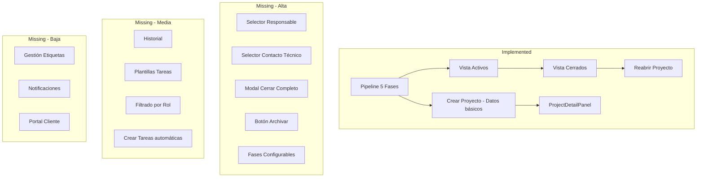

# Análisis del Módulo 3: Proyectos (Pipeline 5 Fases)

## Comparación: Especificación vs Implementación Actual

---

## 1. ✅ IMPLEMENTADO

### 1.1 Estructura de Datos del Proyecto
La interfaz [`Proyecto`](netops-crm/src/types/proyectos.ts:24) ya incluye la mayoría de campos especificados:

| Campo | Estado | Notas |
|-------|--------|-------|
| id | ✅ | UUID |
| empresa_id | ✅ | |
| nombre | ✅ | |
| descripcion | ✅ | |
| fase_actual | ✅ | 1-5 |
| estado | ✅ | activo/cerrado |
| fecha_inicio | ✅ | |
| fecha_estimada_fin | ✅ | |
| fecha_real_fin | ✅ | |
| fecha_cierre | ✅ | |
| motivo_cierre | ✅ | |
| fecha_inicio_negociacion | ✅ | |
| fecha_aceptacion_propuesta | ✅ | |
| fecha_inicio_implementacion | ✅ | |
| moneda | ✅ | USD/MXN |
| monto_estimado | ✅ | |
| monto_real | ✅ | |
| probabilidad_cierre | ✅ | |
| responsable_id | ✅ | |
| responsable_nombre | ✅ | |
| equipo | ✅ | |
| contacto_tecnico_id | ✅ | |
| tags | ✅ | |
| requiere_compras | ✅ | |
| creado_en | ✅ | |

### 1.2 Pipeline de 5 Fases
- ✅ Las 5 fases están definidas en [`FASES`](netops-crm/src/types/proyectos.ts:16) (Prospecto, Diagnóstico, Propuesta, Implementación, Cierre)
- ✅ Pipeline visual con columnas por fase
- ✅ Estadísticas por fase (MiniStat)
- ✅ Movimiento entre fases (botones ← →)

### 1.3 Vista de Proyectos Activos
- ✅ [`proyectos/page.tsx`](netops-crm/src/app/(dashboard)/dashboard/proyectos/page.tsx:304) - Grid de 5 columnas para el pipeline
- ✅ [`ProjectCard`](netops-crm/src/components/module/ProjectCard.tsx) - Tarjetas con información del proyecto
- ✅ Filtrado por estado = activo

### 1.4 Vista de Proyectos Cerrados
- ✅ Pestaña "Cerrados" en el [`ModuleHeader`](netops-crm/src/app/(dashboard)/dashboard/proyectos/page.tsx:278)
- ✅ Lista de proyectos cerrados
- ✅ Botón de Reabrir

### 1.5 Modal de Crear Proyecto
- ✅ Nombre del proyecto
- ✅ Selección de empresa cliente
- ✅ Moneda y monto estimado
- ✅ Probabilidad de cierre
- ✅ Fecha estimada de fin
- ✅ Flag "Requiere compras"

### 1.6 Panel de Detalles (ProjectDetailPanel)
- ✅ Información del cliente
- ✅ Fase y estado
- ✅ Monto y responsable
- ✅ Fechas de inicio y fin estimada
- ✅ Tags
- ✅ Lista de tareas de la fase actual

---

## 2. ❌ NO IMPLEMENTADO / FALTANTE

### 2.1 Gestión de Fases (CRUD)
| Requisito | Prioridad | Descripción |
|-----------|-----------|-------------|
| **Fases configurables** | ALTA | Las fases están hardcodeadas en [`FASES`](netops-crm/src/types/proyectos.ts:16). Según RN-PRO-02, deben ser configurables por el administrador |
| **Entidad FASE en BD** | ALTA | No existe tabla/configuración para modificar fases |
| **Colores por fase configurables** | MEDIA | Solo los 5 colores hardcodeados |

### 2.2 Plantillas de Tareas
| Requisito | Prioridad | Descripción |
|-----------|-----------|-------------|
| **Entidad PLANTILLA_TAREA** | ALTA | No existe el concepto de plantillas de tareas por fase |
| **Crear tareas desde plantilla** | ALTA | Según RN-PRO-03, al cambiar de fase se deben crear tareas desde plantilla |
| **Asignación por tipo de contacto** | MEDIA | Plantillas должны indicar tipo_contacto_destino |

### 2.3 Historial del Proyecto
| Requisito | Prioridad | Descripción |
|-----------|-----------|-------------|
| **Entidad HISTORIAL_PROYECTO** | ALTA | No hay registro de auditoría |
| **Registro de cambios de fase** | ALTA | No se registra quién/cuándo cambió de fase |
| **Registro de cierre/reapertura** | MEDIA | Aunque se guarda motivo_cierre, no hay historial estructurado |

### 2.4 Sistema de Etiquetas (Tags)
| Requisito | Prioridad | Descripción |
|-----------|-----------|-------------|
| **Entidad ETIQUETA** | MEDIA | No existe gestión de etiquetas predefinidas |
| **Crear etiquetas** | MEDIA | Solo se pueden usar tags libres en el proyecto |
| **Colores por etiqueta** | BAJA | No hay selector de color |

### 2.5 Permisos y Roles (Parcialmente implementado)
| Requisito | Prioridad | Descripción |
|-----------|-----------|-------------|
| **Filtrado por rol comercial (fases 1-3)** | MEDIA | Según RN-PRO-07, comercial solo ve fases 1-3 |
| **Filtrado por rol técnico (fases 4-5)** | MEDIA | Según RN-PRO-06, técnico solo ve fases 4-5 |
| **Permiso "Compras"** | BAJA | Puede ver proyectos que requieren compras |
| **Permiso "Facturación"** | BAJA | Puede ver datos económicos |
| **Portal Cliente** | BAJA | El cliente solo ve su proyecto |

### 2.6 Funcionalidad de Cerrar Proyecto
| Requisito | Prioridad | Descripción |
|-----------|-----------|-------------|
| **Modal de cierre completo** | ALTA | Actualmente solo cambia estado. Falta: motivo_cierre obligatorio, fecha_cierre automática |
| **Validación de motivo** | ALTA | Según RN-PRO-12, el motivo es obligatorio |
| **Sugerencia de cierre en fase 5** | MEDIA | Según RN-PRO-10, al completar tareas en fase 5 debe sugerir cerrar |

### 2.7 Funcionalidad de Archivar
| Requisito | Prioridad | Descripción |
|-----------|-----------|-------------|
| **Botón "Archivar"** | ALTA | No existe en la UI |
| **Clasificación automática** | ALTA | Completado vs Inconcluso según RN-PRO-16 |
| **Integración con Módulo 10** | ALTA | Envío a Drive, eliminación de datos operativos |

### 2.8 Gestión de Contacto Técnico
| Requisito | Prioridad | Descripción |
|-----------|-----------|-------------|
| **Selector de contacto técnico** | ALTA | No existe en el modal de crear proyecto |
| **Validación de contacto** | MEDIA | Debe ser de tipo "Técnico" del cliente |

### 2.9 Gestión de Responsable y Equipo
| Requisito | Prioridad | Descripción |
|-----------|-----------|-------------|
| **Selector de responsable** | ALTA | No existe en el modal de crear proyecto |
| **Selector de equipo** | MEDIA | No permite agregar técnicos secundarios |
| **Validación de responsable** | MEDIA | Debe ser usuario interno con rol técnico |

### 2.10 Fechas Clave Automáticas
| Requisito | Prioridad | Descripción |
|-----------|-----------|-------------|
| **fecha_inicio_negociacion** | BAJA | Se captura pero no se usa |
| **fecha_aceptacion_propuesta** | BAJA | Se captura pero no se usa |
| **fecha_inicio_implementacion** | BAJA | Se captura pero no se usa |
| **Actualización automática** | BAJA | Según RN-PRO-19, deben actualizarse al cambiar de fase |

### 2.11 Notificaciones
| Requisito | Prioridad | Descripción |
|-----------|-----------|-------------|
| **Alerta de inactividad (7 días)** | BAJA | Según RN-PRO-09 |
| **Notificaciones de cambio de fase** | BAJA | Integración con Módulo 9 |

---

## 3. 🔄 PARCIALMENTE IMPLEMENTADO

### 3.1 Edición de Proyecto Cerrado
- ✅ Solo Admin puede reabrir
- ❌ No se pueden editar campos específicos (notas, etiquetas, contacto técnico)
- ❌ No hay validación de "campo crítico" según RN-PRO-15

### 3.2 Crear Nueva Empresa desde Modal
- ✅ Se puede crear empresa desde el modal de proyecto
- ❌ Falta guardar correctamente en el selector después de crear

---

## 4. PRIORIDADES DE IMPLEMENTACIÓN

### Alta Prioridad (Core del módulo)
1. **Selector de responsable** en modal de crear proyecto
2. **Selector de contacto técnico** en modal de crear proyecto
3. **Modal completo de cerrar proyecto** con motivo obligatorio
4. **Botón de archivar** para proyectos cerrados
5. **Fases configurables** (o al menos permitir editar desde admin)

### Media Prioridad (Mejoras funcionales)
6. **Historial de proyecto** (auditoría básica)
7. **Plantillas de tareas** por fase
8. **Filtrado por rol** (comercial vs técnico)
9. **Crear tareas automáticas** al cambiar de fase

### Baja Prioridad (Extras)
10. **Gestión de etiquetas** predefinidas
11. **Notificaciones** de inactividad
12. **Portal del cliente**
13. **Fechas clave automáticas**

---

## 5. DIAGRAMA DE GAP ANALYSIS

---

## 6. RECOMENDACIONES INMEDIATAS

1. **Agregar campos faltantes al modal de crear proyecto:**
   - Responsable (selector de usuarios técnicos)
   - Contacto técnico del cliente (selector de contactos de la empresa)

2. **Mejorar el modal de cerrar proyecto:**
   - Hacer obligatorio el campo "motivo_cierre"
   - Mostrar modal de confirmación

3. **Agregar botón "Archivar"** en la vista de proyectos cerrados (solo Admin)

4. **Implementar sistema de historial** básico para auditoria

5. **Considerar fases configurables** o al menos agregar opciones en configuración de admin
