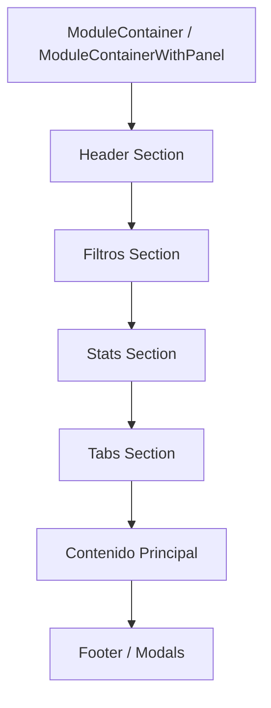

# Plan de Homogeneización de Estructura Visual - NetOps CRM

## 1. Resumen Ejecutivo

Este documento presenta el análisis de la estructura visual actual de los módulos del dashboard en NetOps CRM, identifica las inconsistencias en la posición de las secciones entre cada módulo, establece una guía de estilo con la posición estándar para headers, filtros, tablas, acciones y pies de página, y detalla los cambios necesarios para homogeneizar la estructura visual.

---

## 2. Módulos Analizados

| Módulo | Archivo | Componentes Usados |
|--------|---------|-------------------|
| CRM | `dashboard/crm/page.tsx` | ModuleContainer + div personalizado |
| Tareas | `dashboard/tareas/page.tsx` | ModuleContainerWithPanel + ModuleHeader |
| Soporte | `dashboard/soporte/page.tsx` | ModuleContainerWithPanel + ModuleHeader |
| Archivos | `dashboard/archivos/page.tsx` | ModuleContainer + div personalizado |
| Compras | `dashboard/compras/page.tsx` | ModuleContainer + div personalizado |
| Proyectos | `dashboard/proyectos/page.tsx` | ModuleContainerWithPanel + div personalizado |
| Usuarios | `dashboard/usuarios/page.tsx` | ModuleContainer + div personalizado |
| Calendario | `dashboard/calendario/page.tsx` | ModuleContainer + div personalizado |
| Archivados | `dashboard/archivados/page.tsx` | ModuleContainer + Tabs |

---

## 3. Inconsistencias Identificadas

### 3.1 Headers y Títulos

| Módulo | Enfoque Actual | ¿Usa ModuleHeader? |
|--------|---------------|-------------------|
| Tareas | ModuleHeader | ✅ Sí |
| Soporte | ModuleHeader | ✅ Sí |
| CRM | div personalizado con h1 | ❌ No |
| Archivos | div personalizado con h1 | ❌ No |
| Compras | div personalizado con h1 | ❌ No |
| Proyectos | ModuleHeader (propio) | ❌ No (div manual) |
| Usuarios | div personalizado con h1 | ❌ No |
| Calendario | div personalizado con h1 | ❌ No |
| Archivados | div personalizado con h1 | ❌ No |

**Problemas:**
- Estilos inconsistentes: algunos usan `text-3xl font-bold`, otros variaciones diferentes
- Posición del botón de acción: algunos a la derecha del título, otros a la izquierda
- Descripciones: algunos la tienen, otros no
- Bordes inferiores: algunos tienen `border-b`, otros no

### 3.2 Posición de Filtros

| Módulo | Posición Filtros | Componente |
|--------|-----------------|------------|
| Tareas | Debajo del header, antes de estadísticas | FilterBar |
| Soporte | Debajo del header, antes de estadísticas | FilterBar + inputs de fecha |
| Archivos | Debajo del header, antes de estadísticas | FilterBar |
| Compras | Dentro de TabsContent (ordenes), antes de la lista | FilterBar |
| Proyectos | No tiene filtros estándar | N/A |
| Usuarios | Debajo del header, con selectores manuales | div + Select |
| Calendario | Debajo del header, antes de estadísticas | FilterBar |
| Archivados | Dentro de TabsContent, antes de contenido | FilterBar |

**Problemas:**
- Algunos módulos tienen filtros en posiciones muy diferentes
- La combinación de FilterBar con inputs de fecha adicionales es inconsistente
- Usuarios usa Select manual en lugar de FilterBar

### 3.3 Posición de Estadísticas (MiniStats/StatGrid)

| Módulo | Posición | Notas |
|--------|----------|-------|
| Tareas | Debajo de filtros | StatGrid |
| Soporte | Debajo de filtros (pero no visible en código shown) | StatGrid |
| Archivos | Debajo de filtros | StatGrid cols=5 |
| Compras | Debajo del header, antes de Tabs | StatGrid cols=4 |
| Proyectos | No tiene stat grid visible | N/A |
| Usuarios | No tiene stat grid | N/A |
| Calendario | Debajo de filtros | StatGrid cols=4 |
| Archivados | Dentro de TabsContent | MiniStats individuales |

**Problemas:**
- Inconsistencia en cuándo mostrar estadísticas
- Algunos módulos las muestran antes de los tabs, otros después

### 3.4 Tabs

| Módulo | Posición Tabs | Ubicación Real |
|--------|---------------|----------------|
| Soporte | En ModuleHeader | Parte superior |
| Compras | Después de stats | Debajo de estadísticas |
| Archivados | Después del header | Debajo del título |
| CRM | Usa Tabs de Radix | Dentro del contenido |

**Problemas:**
- Posición de tabs no es consistente
- Algunos en header, otros después de stats

### 3.5 Botones de Acción (Crear/Nuevo)

| Módulo | Posición | ¿En header? |
|--------|----------|-------------|
| Tareas | Extremo derecho del ModuleHeader | ✅ Sí |
| Soporte | En ModuleHeader | ✅ Sí |
| CRM | Extremo derecho del div | ✅ Sí |
| Archivos | Extremo derecho del div | ✅ Sí |
| Compras | Extremo derecho del div | ✅ Sí |
| Proyectos | En modal | ❌ No visible |
| Usuarios | Extremo derecho del div | ✅ Sí |
| Calendario | Extremo derecho del div | ✅ Sí |
| Archivados | No tiene botón crear | N/A |

**Problemas:**
- Algunos módulos no tienen botón de acción visible
- Proyectos abre modal directamente desde URL

### 3.6 Contenedores

| Componente | Uso | Características |
|------------|-----|-----------------|
| ModuleContainer | Módulos sin panel | `h-[calc(100vh-8rem)]`, `space-y-6`, `p-6`, `rounded-xl bg-slate-900/50` |
| ModuleContainerWithPanel | Módulos con panel lateral | Flex container con BaseSidePanel |

---

## 4. Guía de Estilo - Posición Estándar

### 4.1 Estructura General del Módulo



### 4.2 Orden Estándar de Secciones

| # | Sección | Posición | Descripción |
|---|---------|----------|-------------|
| 1 | **Header** | Superior | Título, descripción, tabs, botón de acción |
| 2 | **Filtros** | Debajo del header | FilterBar con búsqueda y selects |
| 3 | **Estadísticas** | Debajo de filtros | StatGrid con MiniStats |
| 4 | **Tabs** | Opcional, debajo de stats | Si el módulo tiene múltiples vistas |
| 5 | **Contenido** | Principal | Lista, grid, tabla, o pipeline |
| 6 | **Footer** | Final | Modales y diálogos |

### 4.3 Especificaciones por Sección

#### Header
```
┌─────────────────────────────────────────────────────────────────┐
│ [Título]                           [Tabs]    [Botón Acción]   │
│ [Descripción]                                                    │
└─────────────────────────────────────────────────────────────────┘
```

- **Título**: `text-3xl font-bold` con icono opcional
- **Descripción**: `text-muted-foreground mt-1`
- **Tabs**: Dentro del header, a la derecha del título
- **Botón de Acción**: Extremo derecho, después de tabs
- **Borde**: `border-b border-border/30 pb-6`

**Componente recomendado**: `ModuleHeader`

#### Filtros
```
┌─────────────────────────────────────────────────────────────────┐
│ [🔍 Buscar...]  [Select 1] [Select 2] [Select 3] [Limpiar]    │
└─────────────────────────────────────────────────────────────────┘
```

- **Componente**: `FilterBar`
- **Posición**: Debajo del header, con `gap-4`
- **Búsqueda**: `min-w-[200px] max-w-md`
- **Selects**: Ancho definido por cada filtro
- **Botón Limpiar**: Solo visible cuando hay filtros activos

#### Estadísticas
```
┌─────────────────────────────────────────────────────────────────┐
│ ┌─────────┐ ┌─────────┐ ┌─────────┐ ┌─────────┐               │
│ │ Stat 1  │ │ Stat 2  │ │ Stat 3  │ │ Stat 4  │               │
│ └─────────┘ └─────────┘ └─────────┘ └─────────┘               │
└─────────────────────────────────────────────────────────────────┘
```

- **Componente**: `StatGrid` con `cols={n}`
- **Posición**: Debajo de filtros
- **Layout**: Grid de tarjetas pequeñas

#### Tabs (Opcional)
```
┌─────────────────────────────────────────────────────────────────┐
│ [Tab 1] [Tab 2] [Tab 3]                                        │
└─────────────────────────────────────────────────────────────────┘
```

- **Posición**: Después de estadísticas
- **Componente**: `Tabs` de Radix UI

#### Contenido Principal
- **Listas**: Grid de cards o lista vertical
- **Tablas**: Tabla con headers y rows
- **Pipeline**: Columnas horizontales para kanban

#### Footer/Modals
- **Modales**: Fuera del contenido principal, al final del componente

---

## 5. Cambios Recomendados por Módulo

### 5.1 CRM (`dashboard/crm/page.tsx`)

| Cambio | Descripción |
|--------|-------------|
| 1 | Reemplazar div del header con `ModuleHeader` |
| 2 | Mover `FilterBar` a posición estándar (debajo del header) |
| 3 | Mover `StatGrid` después de filtros |
| 4 | Verificar posición de Tabs dentro del contenido |

### 5.2 Proyectos (`dashboard/proyectos/page.tsx`)

| Cambio | Descripción |
|--------|-------------|
| 1 | Reemplazar div del header con `ModuleHeader` |
| 2 | Añadir `FilterBar` si es necesario para filtrar proyectos |
| 3 | Añadir `StatGrid` para mostrar estadísticas de proyectos |

### 5.3 Compras (`dashboard/compras/page.tsx`)

| Cambio | Descripción |
|--------|-------------|
| 1 | Mover `StatGrid` a posición estándar (debajo de filtros) |
| 2 | Verificar que `Tabs` esté después de estadísticas |
| 3 | Considerar mover botón de acción a header |

### 5.4 Usuarios (`dashboard/usuarios/page.tsx`)

| Cambio | Descripción |
|--------|-------------|
| 1 | Reemplazar div del header con `ModuleHeader` |
| 2 | Reemplazar filtros manuales con `FilterBar` |
| 3 | Añadir `StatGrid` con estadísticas de usuarios |

### 5.5 Calendario (`dashboard/calendario/page.tsx`)

| Cambio | Descripción |
|--------|-------------|
| 1 | Reemplazar div del header con `ModuleHeader` |
| 2 | Posición de `FilterBar` ya es correcta |
| 3 | Posición de `StatGrid` ya es correcta |

### 5.6 Archivados (`dashboard/archivados/page.tsx`)

| Cambio | Descripción |
|--------|-------------|
| 1 | Reemplazar div del header con `ModuleHeader` |
| 2 | Mover `StatGrid` dentro de tabs a posición consistente |
| 3 | Mover `FilterBar` a posición estándar |

---

## 6. Plan de Implementación

### Fase 1: Actualizar Componentes Base

1. **ModuleHeader**: Verificar que soporta todas las variantes necesarias
2. **FilterBar**: Verificar que tiene todas las props necesarias
3. **ModuleContainer**: Confirmar consistencia entre variantes

### Fase 2: Migrar Módulos (Orden recomendado)

1. **Tareas** - Ya usa la estructura correcta (referencia)
2. **Soporte** - Ya usa la estructura correcta (referencia)
3. **CRM** - Alto uso, migración prioritaria
4. **Proyectos** - Módulo principal, migración importante
5. **Compras** - Estructura media
6. **Calendario** - Estructura media
7. **Archivos** - Estructura media
8. **Usuarios** - Bajo uso
9. **Archivados** - Bajo uso

### Fase 3: Verificación

1. Revisar cada módulo después de cambios
2. Verificar responsive design
3. Probar funcionalidad de filtros
4. Validar accesibilidad

---

## 7. Métricas de Éxito

- ✅ Todos los módulos usan `ModuleHeader` para títulos
- ✅ Todos los módulos tienen `FilterBar` en posición consistente
- ✅ Todos los módulos tienen `StatGrid` en posición consistente (si aplica)
- ✅ Posición de tabs es consistente
- ✅ Botones de acción están en posición estándar

---

## 8. Notas Adicionales

- El componente `ModuleContainerWithPanel` ya tiene la estructura correcta para módulos con panel lateral
- Para módulos sin panel, `ModuleContainer` es suficiente
- Algunos módulos tienen vistas muy diferentes (ej: kanban vs lista) que pueden requerir excepciones
- Los módulos de solo lectura pueden no necesitar botón de acción

---

*Documento generado como parte del análisis de homogeneización de UI en NetOps CRM*
