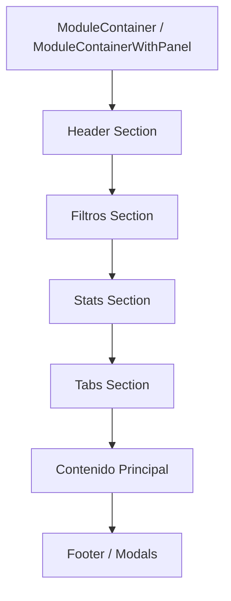

## 1. Guía de Estilo - Posición Estándar

### 1.1 Estructura General del Módulo



### 1.2 Orden Estándar de Secciones

| # | Sección | Posición | Descripción |
|---|---------|----------|-------------|
| 1 | **Header** | Superior | Título, descripción, tabs, botón de acción |
| 2 | **Filtros** | Debajo del header | FilterBar con búsqueda y selects |
| 3 | **Estadísticas** | Debajo de filtros | StatGrid con MiniStats |
| 4 | **Tabs** | Opcional, debajo de stats | Si el módulo tiene múltiples vistas |
| 5 | **Contenido** | Principal | Lista, grid, tabla, o pipeline |
| 6 | **Footer** | Final | Modales y diálogos |

### 1.3 Especificaciones por Sección

#### Header
```
┌─────────────────────────────────────────────────────────────────┐
│ [Título]                           [Tabs]    [Botón Acción]   │
│ [Descripción]                                                    │
└─────────────────────────────────────────────────────────────────┘
```

- **Título**: `text-3xl font-bold` con icono opcional
- **Descripción**: `text-muted-foreground mt-1`
- **Tabs**: Dentro del header, a la derecha del título
- **Botón de Acción**: Extremo derecho, después de tabs
- **Borde**: `border-b border-border/30 pb-6`

**Componente recomendado**: `ModuleHeader`

#### Filtros
```
┌─────────────────────────────────────────────────────────────────┐
│ [🔍 Buscar...]  [Select 1] [Select 2] [Select 3] [Limpiar]    │
└─────────────────────────────────────────────────────────────────┘
```

- **Componente**: `FilterBar`
- **Posición**: Debajo del header, con `gap-4`
- **Búsqueda**: `min-w-[200px] max-w-md`
- **Selects**: Ancho definido por cada filtro
- **Botón Limpiar**: Solo visible cuando hay filtros activos

#### Estadísticas
```
┌─────────────────────────────────────────────────────────────────┐
│ ┌─────────┐ ┌─────────┐ ┌─────────┐ ┌─────────┐               │
│ │ Stat 1  │ │ Stat 2  │ │ Stat 3  │ │ Stat 4  │               │
│ └─────────┘ └─────────┘ └─────────┘ └─────────┘               │
└─────────────────────────────────────────────────────────────────┘
```

- **Componente**: `StatGrid` con `cols={n}`
- **Posición**: Debajo de filtros
- **Layout**: Grid de tarjetas pequeñas

#### Tabs (Opcional)
```
┌─────────────────────────────────────────────────────────────────┐
│ [Tab 1] [Tab 2] [Tab 3]                                        │
└─────────────────────────────────────────────────────────────────┘
```

- **Posición**: Después de estadísticas
- **Componente**: `Tabs` de Radix UI

#### Contenido Principal
- **Listas**: Grid de cards o lista vertical
- **Tablas**: Tabla con headers y rows
- **Pipeline**: Columnas horizontales para kanban

#### Footer/Modals
- **Modales**: Fuera del contenido principal, al final del componente
---