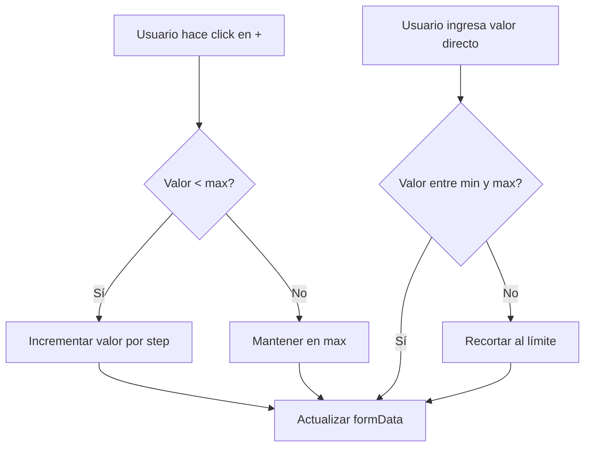

# Plan: InputNumber con Botones de Incremento/Decremento

## Objetivo
Modificar el componente `InputNumber` existente para incluir botones de incremento/decremento (stepper) que se integren estéticamente con el resto de la aplicación.

## Análisis del Estado Actual

### CreateProjectModal.tsx
- **Línea 369-378**: Campo "Probabilidad de Cierre (%)" usa `Input` nativo de tipo número
- **Línea 352-362**: Campo "Monto Estimado" ya usa `InputNumber` (sin stepper)

### InputNumber.tsx actual
- Solo tiene input de tipo número
- Soporta moneda opcionalmente
- No tiene botones de incremento/decremento

## Solución Propuesta

### 1. Modificar InputNumber para agregar Stepper

**Nuevas props a agregar:**
```typescript
interface InputNumberProps {
  // ... props existentes
  /** Mostrar botones de incremento/decremento */
  showStepper?: boolean
  /** Valor del paso (cuánto incrementar/decrementar) */
  step?: number
  /** Valor mínimo */
  min?: number
  /** Valor máximo */
  max?: number
  /** Función callback cuando cambia el valor (para uso interno del stepper) */
  onStep?: (value: number) => void
}
```

### 2. Estilos de los Botones

Los botones deben seguir el estilo de la aplicación:
- Borde: `border-2 border-input`
- Radio: `rounded-lg`
- Fondo: `bg-background`
- Sombras en hover: `hover:shadow-sm`
- Transiciones: `transition-all duration-300`
- Efecto scale en click: `active:scale-95`
- Tamaño: proporcionales al input (h-10)
- Iconos: `+` y `-` con `lucide-react`

**Estructura visual:**
```
┌─────────────────────────────────────┐
│ [+ ] [ Input de número ]           │
└─────────────────────────────────────┘
     o bien
┌─────────────────────────────────────┐
│ [ Input de número ] [-] [+]        │
└─────────────────────────────────────┘
```

**Diseño recomendado:** Botones a la derecha del input (estilo inline)

### 3. Lógica de Incremento/Decremento

- Click en `+`: incrementa el valor por `step`
- Click en `-`: decrementa el valor por `step`
- Validación: no permitir valores menores a `min` o mayores a `max`
- El input debe seguir aceptando ingreso directo de valores

### 4. Integración en CreateProjectModal

**Probabilidad de Cierre:**
- Cambiar de `Input` nativo a `InputNumber`
- Configurar: `showStepper={true}`, `step={5}`, `min={0}`, `max={100}`
- El valor inicial es 20 (ya definido en PROYECTO_VACIO)

**Monto Estimado:**
- Ya usa `InputNumber`, agregar `showStepper={true}`
- Configurar: `step={100}` (o 1000 para valores grandes)

## Implementación en Código

### Paso 1: Modificar InputNumber.tsx
1. Importar iconos de lucide-react (Plus, Minus)
2. Agregar nuevas props al interface
3. Agregar lógica de state interno para el stepper
4. Renderizar botones a la derecha del input
5. Aplicar estilos consistentes con la app

### Paso 2: Modificar CreateProjectModal.tsx
1. Cambiar Input nativo por InputNumber en "Probabilidad de Cierre"
2. Agregar props de stepper: `showStepper`, `step`, `min`, `max`
3. Verificar que "Monto Estimado" también tenga stepper

### Paso 3: Verificación
- [ ] Incremento con botón +
- [ ] Decremento con botón -
- [ ] Ingreso directo de valores
- [ ] Validación de rango 0-100
- [ ] Diseño consistente con otros botones
- [ ] Responsive (tamaño en móvil)

## Mermaid: Flujo de Datos



## Notas Adicionales

- Los botones deben estar deshabilitados cuando el valor esté en el límite
- El input debe mostrar el valor actual correctamente
- La moneda (si existe) debe coexistir con los botones de stepper
- El diseño debe ser responsive - considerar móvil donde los botones sean más importantes
