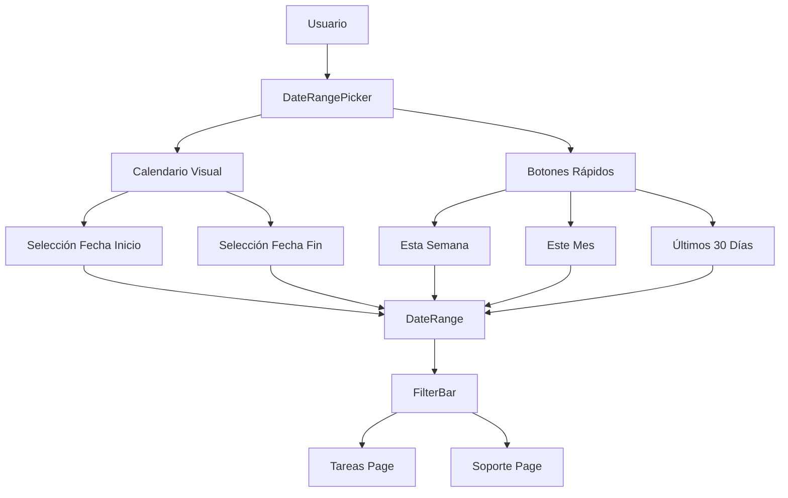

# Plan de Corrección: Filtros de Fecha con Calendario Visual

## Problema Identificado

Los módulos de **Tareas** y **Soporte** tienen filtros por fecha que actualmente utilizan `<Input type="date">` (input nativo del navegador), lo cual:

1. **No ofrece calendario visual** - Los usuarios no pueden ver un calendario para seleccionar fechas
2. **No están unificados** - Cada módulo implementa los filtros de forma independiente y con formatos ligeramente diferentes
3. **Experiencia de usuario inconsistente** - El comportamiento varía entre módulos

### Situación Actual

#### Módulo de Tareas (`tareas/page.tsx`)
- Líneas 536-582: Filtros de fecha "Desde" y "Hasta" implementados fuera del FilterBar
- Usan `<Input type="date">` con estilos manuales
- Tienen filtro adicional de "Vencidas" con Checkbox

#### Módulo de Soporte (`soporte/page.tsx`)
- Líneas 482-500: Similar implementación con `<Input type="date">`
- También fuera del FilterBar
- Sin filtro de vencidas

## Solución Propuesta

### 1. Crear Componente DateRangePicker Reutilizable

**Ubicación**: `src/components/ui/date-range-picker.tsx`

**Características**:
- Calendario visual mensual con navegación entre meses
- Selector de rango de fechas (fecha inicio - fecha fin)
- Botones de selección rápida:
  - Hoy
  - Ayer
  - Esta semana
  - Semana pasada
  - Este mes
  - Mes pasado
  - Últimos 7 días
  - Últimos 30 días
  - Personalizado
- Campo de entrada que muestra el rango seleccionado
- Popover/Dialog para mostrar el calendario

**Interfaces TypeScript**:
```typescript
interface DateRange {
  from: Date | undefined
  to: Date | undefined
}

interface DateRangePickerProps {
  value?: DateRange
  onChange?: (range: DateRange) => void
  placeholder?: string
  className?: string
  disabled?: boolean
}
```

### 2. Actualizar Componente FilterBar

**Ubicación**: `src/components/ui/filter-bar.tsx`

**Modificaciones**:
- Agregar soporte para filtros de tipo fecha
- Agregar nueva configuración `dateFilter` al FilterBarProps
- Renderizar DateRangePicker cuando el filtro sea de tipo fecha

**Nueva Interface**:
```typescript
export interface FilterConfig {
  key: string
  label?: string
  placeholder?: string
  options?: FilterOption[]
  width?: string
  type?: 'select' | 'date'  // Nuevo campo
  dateRange?: DateRangePickerProps  // Configuración de fecha
}
```

### 3. Actualizar Página de Tareas

**Cambios**:
- Reemplazar los `<Input type="date">` por el nuevo DateRangePicker
- O integrarlo en el FilterBar para mantener consistencia
- Mantener el filtro de "Vencidas" con Checkbox

### 4. Actualizar Página de Soporte

**Cambios**:
- Reemplazar los filtros de fecha actuales por el nuevo componente
- Unificar formato con el módulo de tareas

## Diagrama de Arquitectura



## Pasos de Implementación

### Paso 1: Crear Componente DateRangePicker
- Crear `src/components/ui/date-range-picker.tsx`
- Implementar calendario visual con React
- Usar componentes de Radix UI (Dialog/Popover)
- Estilizar con Tailwind CSS
- Agregar iconos de Lucide React

### Paso 2: Actualizar FilterBar
- Modificar `src/components/ui/filter-bar.tsx`
- Agregar soporte para filtros de tipo fecha
- Exportar tipos necesarios

### Paso 3: Actualizar Módulo Tareas
- Modificar `src/app/(dashboard)/dashboard/tareas/page.tsx`
- Reemplazar Inputs de fecha por DateRangePicker
- Actualizar lógica de filtrado

### Paso 4: Actualizar Módulo Soporte
- Modificar `src/app/(dashboard)/dashboard/soporte/page.tsx`
- Reemplazar Inputs de fecha por DateRangePicker
- Actualizar lógica de filtrado

## Consideraciones Técnicas

1. **Sin dependencias externas**: Se implementará sin librerías de calendario adicionales
2. **Radix UI**: Usar Dialog o Popover de Radix para el calendario
3. **Tailwind CSS**: Todo el estilizado con clases de Tailwind
4. **TypeScript**: Tipado estricto para props y eventos
5. **Responsive**: El componente debe funcionar en móvil y escritorio

## Beneficios Esperados

1. **Experiencia de usuario mejorada**: Selector visual de fechas en lugar de input nativo
2. **Consistencia**: Mismo componente usado en toda la aplicación
3. **Mantenibilidad**: Un solo componente para mantener y actualizar
4. **Accesibilidad**: Mejor navegación con teclado y lectores de pantalla
