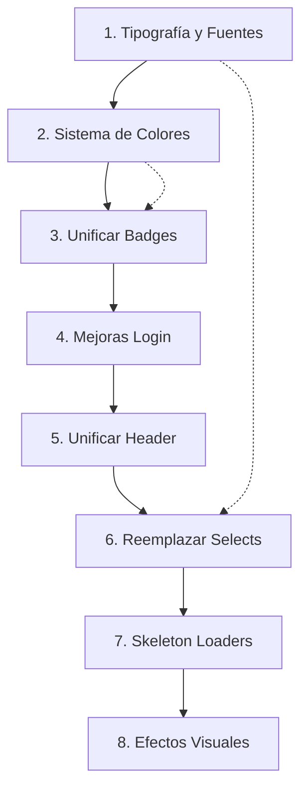

# Plan de Implementación: Mejoras Visuales NetOps CRM

## Resumen Ejecutivo

Este documento detalla el plan de implementación para las mejoras visuales solicitadas en NetOps CRM. El plan está estructurado en fases con dependencias claramente identificadas para garantizar una implementación ordenada y eficiente.

---

## Orden de Ejecución Recomendado (Dependencias)



---

## Lista de Tareas Detalladas

### TAREA 1: Tipografía Profesional

**Prioridad:** ALTA | **Dependencias:** Ninguna

**Archivos a modificar:**
- `netops-crm/tailwind.config.ts`
- `netops-crm/src/app/globals.css`

**Cambios requeridos:**

1. **tailwind.config.ts** - Agregar fuentes a la configuración:

```typescript
// Agregar en theme.extend
fontFamily: {
  sans: ['Inter', 'Plus Jakarta Sans', 'system-ui', 'sans-serif'],
  display: ['Plus Jakarta Sans', 'system-ui', 'sans-serif'],
},
```

2. **globals.css** - Importar fuentes con next/font:

```css
@import url('https://fonts.googleapis.com/css2?family=Inter:wght@300;400;500;600;700&family=Plus+Jakarta+Sans:wght@400;500;600;700;800&display=swap');

/* O mejor, usar next/font en layout.tsx */
```

**Nota de implementación:** Se recomienda usar `next/font/google` en `layout.tsx` para mejor rendimiento y CLS优化.

---

### TAREA 2: Sistema de Colores Expandido

**Prioridad:** ALTA | **Dependencias:** Tarea 1

**Archivos a modificar:**
- `netops-crm/src/app/globals.css`

**Cambios requeridos:**

```css
/* Agregar en :root después de las variables existentes */
:root {
  /* Estados */
  --success: 142 76% 36%;
  --success-foreground: 355.7 100% 97.3%;
  --warning: 38 92% 50%;
  --warning-foreground: 38 92% 10%;
  --info: 199 89% 48%;
  --info-foreground: 199 89% 98%;
  --error: 0 84% 60%;
  --error-foreground: 0 0% 100%;
  
  /* Fases de Proyecto */
  --phase-discovery: 262 83% 58%;
  --phase-design: 281 83% 58%;
  --phase-development: 190 80% 35%;
  --phase-testing: 38 92% 50%;
  --phase-deployment: 142 76% 36%;
}
```

**En tailwind.config.ts agregar:**

```typescript
// Agregar en theme.extend.colors
success: {
  DEFAULT: "hsl(var(--success))",
  foreground: "hsl(var(--success-foreground))",
},
warning: {
  DEFAULT: "hsl(var(--warning))",
  foreground: "hsl(var(--warning-foreground))",
},
info: {
  DEFAULT: "hsl(var(--info))",
  foreground: "hsl(var(--info-foreground))",
},
error: {
  DEFAULT: "hsl(var(--error))",
  foreground: "hsl(var(--error-foreground))",
},
// Colores de fase
phase: {
  discovery: "hsl(var(--phase-discovery))",
  design: "hsl(var(--phase-design))",
  development: "hsl(var(--phase-development))",
  testing: "hsl(var(--phase-testing))",
  deployment: "hsl(var(--phase-deployment))",
}
```

---

### TAREA 3: Unificación de Badges y Estados

**Prioridad:** ALTA | **Dependencias:** Tarea 2

**Archivos a modificar:**
- `netops-crm/src/components/module/StatusBadge.tsx`

**Cambios requeridos:**

```typescript
// Actualizar el componente para usar variables CSS unificadas
// y eliminar redundancias

const ESTADO_COLORS: Record<string, string> = {
  // Estados activos/positivos
  'Activo': 'bg-success/15 text-success/80',
  'Completado': 'bg-success/15 text-success/80',
  'Completada': 'bg-success/15 text-success/80',
  'Resuelto': 'bg-success/15 text-success/80',
  'Confirmada': 'bg-success/15 text-success/80',
  'Recibida completa': 'bg-success/15 text-success/80',
  
  // Estados pendientes/advertencia
  'Pendiente': 'bg-warning/15 text-warning/80',
  'En progreso': 'bg-info/15 text-info/80',
  'Tentativa': 'bg-warning/15 text-warning/80',
  'Pendiente aprobación': 'bg-warning/15 text-warning/80',
  'Esperando cliente': 'bg-info/15 text-info/80',
  
  // Estados negativos
  'Cancelado': 'bg-error/15 text-error/80',
  'Cancelada': 'bg-error/15 text-error/80',
  'Bloqueada': 'bg-error/15 text-error/80',
  
  // Estados neutros
  'Inactivo': 'bg-muted text-muted-foreground',
  'Cerrado': 'bg-muted text-muted-foreground',
  'Borrador': 'bg-muted text-muted-foreground',
  'Abierto': 'bg-info/15 text-info/80',
  'Enviada': 'bg-info/15 text-info/80',
  'Recibida parcial': 'bg-warning/15 text-warning/80',
}

// Agregar función para normalizar estados
const normalizeStatus = (status: string): string => {
  const statusMap: Record<string, string> = {
    'active': 'Activo',
    'inactive': 'Inactivo',
    'pending': 'Pendiente',
    'in_progress': 'En progreso',
    'completed': 'Completado',
    'cancelled': 'Cancelado',
    // Agregar más mapeos según necesidad
  }
  return statusMap[status.toLowerCase()] || status
}
```

---

### TAREA 4: Mejoras en Login

**Prioridad:** MEDIA | **Dependencias:** Ninguna

**Archivos a modificar:**
- `netops-crm/src/app/(auth)/login/page.tsx`

**Cambios requeridos:**

1. **Corregir tagline (quitar italic):**

```typescript
// Línea 53 - cambiar:
<p className="text-slate-400 mt-1 italic">"La seguridad no es un error"</p>
// Por:
<p className="text-slate-400 mt-1">La seguridad no es un error</p>
```

2. **Ocultar credenciales demo en producción:**

```typescript
// Agregar variable de entorno o constante
const isDemoMode = process.env.NEXT_PUBLIC_DEMO_MODE !== 'false'

// Reemplazar líneas 140-149 con:
{isDemoMode && (
  <div className="mt-6 p-4 rounded-lg bg-slate-900/50 border border-slate-800">
    <p className="text-xs text-slate-500 mb-2 font-medium">CREDENCIALES DE DEMO</p>
    <div className="space-y-1 text-xs text-slate-400">
      <p><span className="text-slate-500">Admin:</span> admin@apex.com / cualquier</p>
      <p><span className="text-slate-500">Comercial:</span> comercial@apex.com / cualquier</p>
      <p><span className="text-slate-500">Técnico:</span> tecnico@apex.com / cualquier</p>
      <p><span className="text-slate-500">Cliente:</span> cliente@empresa.com / cualquier</p>
    </div>
  </div>
)}
```

---

### TAREA 5: Unificación de Header

**Prioridad:** ALTA | **Dependencias:** Tareas 1, 2

**Archivos a modificar:**
- `netops-crm/src/components/header.tsx` (crear componente reutilizable)
- `netops-crm/src/app/(dashboard)/layout.tsx` (usar componente)
- `netops-crm/src/components/header.tsx` (actualizar para usar el nuevo)

**Cambios requeridos:**

1. **Crear DashboardHeader.tsx** (nuevo archivo):

```typescript
// netops-crm/src/components/DashboardHeader.tsx
"use client"

import * as React from "react"
import { cn } from "@/lib/utils"
import { Button } from "@/components/ui/button"
import { Input } from "@/components/ui/input"
import { Avatar, AvatarFallback, AvatarImage } from "@/components/ui/avatar"
import { Badge } from "@/components/ui/badge"
import {
  Search,
  Bell,
  Plus,
  ChevronDown,
  Menu,
  Zap,
} from "lucide-react"

interface DashboardHeaderProps {
  user?: {
    nombre: string
    roles: string[]
    imagen?: string
  }
  onMenuClick?: () => void
  onNewProject?: () => void
}

export function DashboardHeader({ 
  user, 
  onMenuClick,
  onNewProject 
}: DashboardHeaderProps) {
  const getRoleLabel = (role: string) => {
    const labels: Record<string, string> = {
      admin: 'Admin',
      comercial: 'Comercial',
      tecnico: 'Técnico',
      compras: 'Compras',
      facturacion: 'Facturación',
      marketing: 'Marketing',
      cliente: 'Cliente',
    }
    return labels[role] || role
  }

  const getInitials = (name: string) => {
    return name.split(' ').map(n => n[0]).join('').toUpperCase().slice(0, 2)
  }

  return (
    <header className="sticky top-0 z-30 h-20 border-b border-border/50 bg-background/95 backdrop-blur-xl supports-[backdrop-filter]:bg-background/60">
      <div className="flex h-full items-center justify-between px-6">
        {/* Left side */}
        <div className="flex items-center gap-4">
          <Button
            variant="ghost"
            size="icon"
            onClick={onMenuClick}
            className="lg:hidden h-10 w-10"
          >
            <Menu className="h-5 w-5" />
          </Button>
          
          <div className="relative hidden md:block">
            <Search className="absolute left-3 top-1/2 -translate-y-1/2 h-4 w-4 text-muted-foreground" />
            <Input
              placeholder="Buscar proyectos, clientes, tareas..."
              className="w-80 pl-10 bg-slate-50 dark:bg-slate-900/50 border-input"
            />
          </div>
        </div>

        {/* Right side */}
        <div className="flex items-center gap-3">
          <Button
            variant="default"
            size="sm"
            className="gap-2"
            onClick={onNewProject}
          >
            <Zap className="h-4 w-4" />
            <span className="hidden sm:inline">Nuevo Proyecto</span>
          </Button>

          <div className="h-6 w-px bg-border mx-2" />

          <Button
            variant="ghost"
            size="icon"
            className="relative h-10 w-10"
          >
            <Bell className="h-5 w-5" />
            <span className="absolute top-2 right-2 h-2 w-2 rounded-full bg-red-500" />
          </Button>

          {user && (
            <Button
              variant="ghost"
              size="sm"
              className="gap-2 h-10 px-2"
            >
              <Avatar className="h-8 w-8">
                {user.imagen && <AvatarImage src={user.imagen} />}
                <AvatarFallback className="text-xs">
                  {getInitials(user.nombre)}
                </AvatarFallback>
              </Avatar>
              <div className="hidden md:flex flex-col items-start">
                <span className="text-sm font-medium">{user.nombre.split(' ')[0]}</span>
                <Badge variant="secondary" className="h-5 text-[10px] px-1.5">
                  {getRoleLabel(user.roles[0])}
                </Badge>
              </div>
              <ChevronDown className="h-4 w-4 text-muted-foreground" />
            </Button>
          )}
        </div>
      </div>
    </header>
  )
}
```

2. **Actualizar layout.tsx** para usar el nuevo componente:

```typescript
// Reemplazar el header inline por:
import { DashboardHeader } from '@/components/DashboardHeader'

// En el return del componente:
<DashboardHeader 
  user={user}
  onMenuClick={() => setCollapsed(!collapsed)}
  onNewProject={() => router.push('/dashboard/proyectos?new=true')}
/>
```

---

### TAREA 6: Reemplazar Componentes Nativos

**Prioridad:** MEDIA | **Dependencias:** Tareas 1, 2, 5

**Archivos a modificar:**

1. **Selects nativos por shadcn/ui:**
   - `netops-crm/src/app/(dashboard)/dashboard/proyectos/page.tsx`
   - `netops-crm/src/app/(dashboard)/dashboard/crm/page.tsx`

**Cambios requeridos:**

```typescript
// Importar Select de shadcn
import {
  Select,
  SelectContent,
  SelectItem,
  SelectTrigger,
  SelectValue,
} from "@/components/ui/select"

// Reemplazar select nativo por:
<Select 
  value={empresaId} 
  onValueChange={setEmpresaId}
>
  <SelectTrigger className="w-full">
    <SelectValue placeholder="Seleccionar cliente" />
  </SelectTrigger>
  <SelectContent>
    {empresas.map((empresa) => (
      <SelectItem key={empresa.id} value={empresa.id}>
        {empresa.nombre}
      </SelectItem>
    ))}
  </SelectContent>
</Select>
```

**No se requiere reemplazar window.confirm()** - No se encontró ningún uso en el proyecto actualmente.

---

### TAREA 7: Skeleton Loaders

**Prioridad:** MEDIA | **Dependencias:** Ninguna

**Archivos a crear:**
- `netops-crm/src/components/ui/skeleton.tsx`

**Cambios requeridos:**

```typescript
// netops-crm/src/components/ui/skeleton.tsx
import { cn } from "@/lib/utils"

function Skeleton({
  className,
  ...props
}: React.HTMLAttributes<HTMLDivElement>) {
  return (
    <div
      className={cn(
        "animate-pulse rounded-md bg-muted/60",
        className
      )}
      {...props}
    />
  )
}

// Componentes de Skeleton predefinidos
function CardSkeleton() {
  return (
    <div className="rounded-xl border bg-card p-6 space-y-4">
      <div className="flex items-center gap-4">
        <Skeleton className="h-12 w-12 rounded-full" />
        <div className="space-y-2">
          <Skeleton className="h-4 w-32" />
          <Skeleton className="h-3 w-24" />
        </div>
      </div>
      <Skeleton className="h-4 w-full" />
      <Skeleton className="h-4 w-3/4" />
    </div>
  )
}

function TableRowSkeleton({ columns = 4 }: { columns?: number }) {
  return (
    <tr className="border-b">
      {Array.from({ length: columns }).map((_, i) => (
        <td key={i} className="p-4">
          <Skeleton className="h-4 w-full" />
        </td>
      ))}
    </tr>
  )
}

function FormSkeleton() {
  return (
    <div className="space-y-6">
      <div className="space-y-2">
        <Skeleton className="h-4 w-24" />
        <Skeleton className="h-10 w-full" />
      </div>
      <div className="space-y-2">
        <Skeleton className="h-4 w-24" />
        <Skeleton className="h-10 w-full" />
      </div>
      <div className="grid grid-cols-2 gap-4">
        <Skeleton className="h-10" />
        <Skeleton className="h-10" />
      </div>
    </div>
  )
}

export { Skeleton, CardSkeleton, TableRowSkeleton, FormSkeleton }
```

**Uso ejemplo:**

```typescript
// En una página con loading state
export default function Loading() {
  return (
    <div className="space-y-4">
      <Skeleton className="h-8 w-64" />
      <CardSkeleton />
      <CardSkeleton />
      <CardSkeleton />
    </div>
  )
}
```

---

### TAREA 8: Efectos Visuales Adicionales

**Prioridad:** BAJA | **Dependencias:** Tareas 1, 2

**Archivos a modificar:**
- `netops-crm/src/app/globals.css`
- `netops-crm/src/components/ui/button.tsx`
- `netops-crm/src/app/(dashboard)/layout.tsx`

**Cambios requeridos:**

1. **Gradientes sutiles en headers (globals.css):**

```css
/* Agregar clase de gradiente para headers */
.header-gradient {
  background: linear-gradient(
    135deg,
    hsl(var(--background)) 0%,
    hsl(var(--background)) 50%,
    hsl(var(--primary) / 0.02) 100%
  );
}
```

2. **Bordes brillantes en elementos activos (globals.css):**

```css
/* Brillo en elementos activos/focus */
.active-glow {
  box-shadow: 
    0 0 0 1px hsl(var(--primary) / 0.1),
    0 0 20px hsl(var(--primary) / 0.1);
}

.focus-ring {
  @apply focus:outline-none focus:ring-2 focus:ring-primary/50 focus:ring-offset-2;
}
```

3. **Micro-interacciones hover y Glow effects (button.tsx):**

```typescript
// Agregar variantes de botón con glow
const buttonVariants = cva(
  "inline-flex items-center justify-center whitespace-nowrap rounded-lg text-sm font-medium transition-all duration-200 focus-visible:outline-none focus-visible:ring-2 focus-visible:ring-ring focus-visible:ring-offset-2 disabled:pointer-events-none disabled:opacity-50",
  {
    variants: {
      variant: {
        // ... variantes existentes ...
        glow: "bg-primary text-primary-foreground hover:bg-primary/90 hover:shadow-lg hover:shadow-primary/25 active:scale-[0.98]",
        "glow-success": "bg-success text-success-foreground hover:bg-success/90 hover:shadow-lg hover:shadow-success/25 active:scale-[0.98]",
        "glow-warning": "bg-warning text-warning-foreground hover:bg-warning/90 hover:shadow-lg hover:shadow-warning/25 active:scale-[0.98]",
      },
    },
    defaultVariants: {
      variant: "default",
    },
  }
)
```

4. **Transiciones suaves en tarjetas (globals.css):**

```css
/* Hover effects para cards */
.card-hover {
  @apply transition-all duration-200;
}

.card-hover:hover {
  @apply -translate-y-0.5 shadow-lg;
  box-shadow: 
    0 4px 6px -1px rgb(0 0 0 / 0.1),
    0 10px 15px -3px rgb(0 0 0 / 0.1),
    0 0 0 1px hsl(var(--primary) / 0.05);
}
```

---

## Resumen de Archivos

| Acción | Archivo |
|--------|---------|
| **Modificar** | `netops-crm/tailwind.config.ts` |
| **Modificar** | `netops-crm/src/app/globals.css` |
| **Modificar** | `netops-crm/src/components/module/StatusBadge.tsx` |
| **Modificar** | `netops-crm/src/app/(auth)/login/page.tsx` |
| **Crear** | `netops-crm/src/components/DashboardHeader.tsx` |
| **Modificar** | `netops-crm/src/app/(dashboard)/layout.tsx` |
| **Modificar** | `netops-crm/src/app/(dashboard)/dashboard/proyectos/page.tsx` |
| **Modificar** | `netops-crm/src/app/(dashboard)/dashboard/crm/page.tsx` |
| **Crear** | `netops-crm/src/components/ui/skeleton.tsx` |
| **Modificar** | `netops-crm/src/components/ui/button.tsx` |

---

## Matriz de Priorización

| Tarea | Prioridad | Complejidad | Dependencias | Impacto |
|-------|-----------|-------------|--------------|---------|
| 1. Tipografía | ALTA | Baja | Ninguna | Alto |
| 2. Colores | ALTA | Baja | Tarea 1 | Alto |
| 3. Badges | ALTA | Media | Tarea 2 | Medio |
| 4. Login | MEDIA | Baja | Ninguna | Bajo |
| 5. Header | ALTA | Media | Tareas 1,2 | Alto |
| 6. Selects | MEDIA | Alta | Tareas 1,2,5 | Medio |
| 7. Skeletons | MEDIA | Baja | Ninguna | Medio |
| 8. Efectos | BAJA | Media | Tareas 1,2 | Bajo |

---

## Recomendaciones de Implementación

1. **Comenzar por tareas fundamentales**: Las tareas 1 (Tipografía) y 2 (Colores) establecen la base para las demás.

2. **Agrupar tareas relacionadas**: Las tareas 1, 2 y 8 pueden implementarse en paralelo ya que afectan principalmente a archivos globales.

3. **Testing incremental**: Después de cada tarea, verificar que los cambios no rompan la funcionalidad existente.

4. **Mode de implementación sugerido**: Cambiar a modo **Code** para ejecutar las tareas de implementación una por una.

---

*Plan creado: 2026-03-12*
*Proyecto: NetOps CRM - Apex Connectivity*
