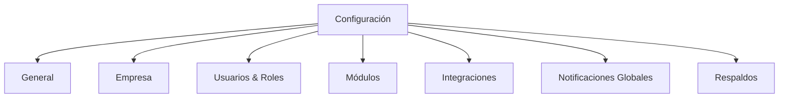

# Plan de Implementación: Módulo de Configuración

## 1. Análisis del Estado Actual

### Lo que ya existe:
- **Página de Perfil** (`/dashboard/perfil`): Configuración de perfil de usuario, seguridad y notificaciones
- **ConfiguracionTab**: Componente para configuración de archivado (en proyectos archivados)
- **Ruta en sidebar**: `/dashboard/configuracion` (probablemente no existe o está vacía)

### Lo que falta:
- Un módulo de configuración centralizado para settings de la aplicación
- Configuración de empresa/organización
- Gestión de roles y permisos
- Configuraciones de módulos individuales

---

## 2. Propuesta de Implementación

### 2.1 Estructura de Pestañas Propuesta



### 2.2 Detalle de Cada Pestaña

#### **B. General**
- Nombre de la aplicación
- Logo y favicon
- Zona horaria predeterminada
- Formato de fecha/hora
- Idioma predeterminado
- Tema (claro/oscuro/sistema)

#### **C. Empresa**
- Datos fiscales (RFC, dirección, teléfono)
- Logo corporativo
- Colores institucionales
- Información de contacto

#### **D. Usuarios & Roles** (Admin only)
- Lista de usuarios
- Gestión de roles
- Permisos por módulo
- Activar/desactivar usuarios

#### **E. Módulos**
- Habilitar/deshabilitar módulos
- Configuración específica por módulo:
  - CRM: Campos personalizados
  - Proyectos: Workflows, estados
  - Tareas: Tipos de tarea
  - Soporte: SLAs, prioridades
  - Archivos: Límites de almacenamiento
  - Compras: Proveedores default

#### **F. Integraciones**
- Google Drive (ya existe en archivos)
- Google Calendar (ya existe en calendario)
- N8N (webhooks)
- Supabase (configuración de DB)
- Email/SMTP

#### **G. Notificaciones Globales**
- Configuración de email SMTP
- Plantillas de email
- Notificaciones push
- Preferencias por defecto

#### **H. Respaldos**
- Programación de respaldos
- Retención de datos
- Exportación de datos

---

## 3. Estructura de Archivos Propuesta

```
src/
├── app/(dashboard)/dashboard/configuracion/
│   └── page.tsx              # Página principal
├── components/module/
│   ├── ConfiguracionTab.tsx  # Ya existe (archivado)
│   ├── SettingsGeneral.tsx    # Nueva - General
│   ├── SettingsEmpresa.tsx    # Nueva - Empresa
│   ├── SettingsUsuarios.tsx  # Nueva - Usuarios y Roles
│   ├── SettingsModulos.tsx   # Nueva - Módulos
│   ├── SettingsIntegraciones.tsx  # Nueva - Integraciones
│   └── SettingsNotificaciones.tsx  # Nueva - Notificaciones
├── constants/
│   └── configuracion.ts      # Nuevo - Constantes
└── types/
    └── configuracion.ts      # Nuevo - Tipos
```

---

## 4. Componentes UI Requeridos

### 4.1 Toggle Switch (para activar/desactivar)
Ya existe como Button variant con estados, pero sería mejor un componente dedicado.

### 4.2 Settings Card
```typescript
interface SettingsCardProps {
  title: string
  description?: string
  icon?: React.ReactNode
  children: React.ReactNode
}
```

### 4.3 Settings Section
```typescript
interface SettingsSectionProps {
  title: string
  description?: string
  children: React.ReactNode
}
```

---

## 5. Plan de Implementación (Steps)

### Step 1: Types y Constants
- Crear `src/types/configuracion.ts`
- Crear `src/constants/configuracion.ts`

### Step 2: Componentes UI de Configuración
- Crear `SettingsCard`
- Crear `SettingsSection`

### Step 3: Componentes de Cada Pestaña
- SettingsGeneral
- SettingsEmpresa
- SettingsUsuarios
- SettingsModulos
- SettingsIntegraciones

### Step 4: Página Principal
- Crear `src/app/(dashboard)/dashboard/configuracion/page.tsx`
- Integrar todos los componentes

### Step 5: Sidebar Update
- Verificar que la ruta funcione

---

## 6. Consideraciones Técnicas

### Persistencia
- Usar localStorage para settings del cliente
- Supabase para settings globales de organización
- Crear tabla `configuracion` en Supabase

### Permisos
- Solo admins pueden acceder a configuración global
- Settings de empresa solo para admins
- Perfil disponible para todos los usuarios

### UI/UX
- Usar el mismo patrón de Tabs que perfil
- Implementar cambios con las transiciones suaves ya aplicadas
- Usar Cards para separar secciones
- Botones de guardar en cada sección

---

## 7. Priorización Sugerida

| Prioridad | Feature | Justificación |
|-----------|---------|---------------|
| Alta | General + Empresa | Lo más básico |
| Alta | Módulos | Control de acceso |
| Media | Usuarios & Roles | Gestión de equipo |
| Media | Integraciones | Ya hay código existente |
| Baja | Notificaciones | Puede ser complejo |
| Baja | Respaldos | Depende de infraestructura |

---

## 8. Próximos Pasos Inmediatos

1. Aprobar este plan
2. Confirmar qué features son prioridad
3. Decidir si usar localStorage o Supabase para persistencia
4. Comenzar con Step 1 (Types y Constants)
